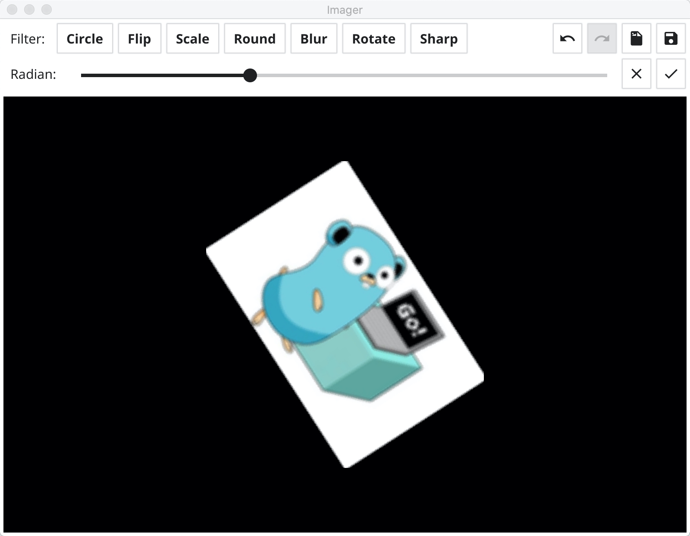

# imager


image tool in go

---

###Summary

The *imager* is a simple image tool lib, For learning only.

### Usage
``` go
    // import 
    import github.com/tk103331/imager
    
    // single operation
    imager.New(image.Image).Blur(2)
    imager.New(image.Image).Scale(2)
    
    // chain operation
    imager.New(image.Image)
        .Rotate(0.2)
        .Scale(2)
        .Round(20)
```


### API

#### Circle(mode CircleMode)

#### Crop(rect image.Rectangle)

#### Flip(mode FlipMode)

#### Scale(scale float64)

#### Round(radius int)

#### Blur(level int)

#### Sharp()

#### Rotate(radian float64)

### GUI Demo


